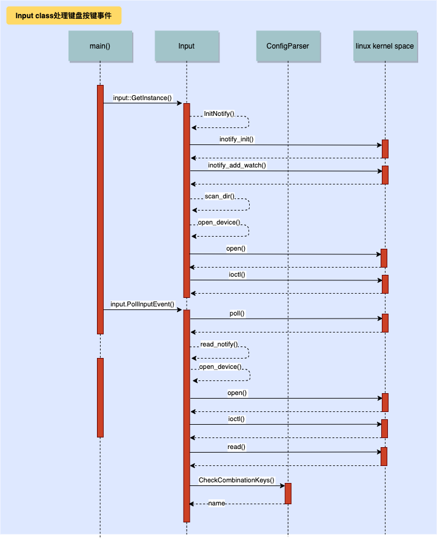

# keyboard_monitor需求分析
独立于原有的按键系统，另外写一个进程获取按键和组合按键，hal层通过另外的网络客户端，C++的客户端连接，java层的服务端接收发送过来的网络套接字，不能影响本来的按键系统。
1. 接收输入系统的输入信号。
2. 读取指定位置的输入配置文件，配置文件中包含应用系统需要感知的热键或组合快捷键。
3. 配置文件中定义的热键或组合按键，发送给指定的系统应用，同时在系统中消耗掉按键事件。如果输入不包含在2中配置文件里面，该输入事件按系统正常逻辑分发。
4. 配置文件示例。
5. 需要提供配置文件更新接口，应用按照接口要求传入配置文件内容，Input系统能够更具输入内容更新配置文件，更新完成之后立即生效.(目前先做成由JAVA层应用程序更新配置文件，并发送socket命令给keyboard_monitor去重新读取配置文件。)
6. 如果需要新增加服务，需要做服务的性能，内存，稳定性测试。

# How to use it
## 1. 组合按键配置文件
配置文件定义的内容如下：
```
{
    "combination_keys":
    [
        {"name":"Tirgger_Exit", "keys": ["KEY_LEFTCTRL", "KEY_C"]},
        {"name":"Tirgger_Restart", "keys": ["KEY_LEFTALT", "KEY_A"]},
        {"name":"Tirgger_poweroff", "keys": ["KEY_LEFTALT", "KEY_LEFTSHIFT", "KEY_DELETE"]}
    ]
}
```
组合按键的定义由name和keys组合，其中name定义了keyboard_monitor当识别到keys中组合按键后发给JAVA层应用程序的信息，而keys定义了需要哪些按键才能触发name的发送。
要注意的是keys中的字符串是有要求的，因为是从android input中读到的信息，所以和实际按键有一个对应关系，已经在Key Mapping中全部写清楚了按键对应关系，在添加定义时一定要先去查定义。
配置文件暂时放在`/data/input_config.json`。
src/main_inputsubsystem.cpp中如下定义
```
#define CONFIG_PATH "/data/input_config.json"
```

# 2. Socket配置
src/main_inputsubsystem.cpp中有如下定义：
```
#define IP_ADDRESS    "127.0.0.1"
#define PORT          5050
```
可以根据socket server的实际情况进行修改。

src/input.cpp中有如下定义：
```
#define CMD_REREAD_CONFIG "cmd_config_file_updated\n"
```
这个字符串是JAVA层应用程序通知keyboard_monitor重新读取配置文件的命令。这里多了一个转义字符`\n`是因为目前test socket server app发出来默认带上的，后续视实际情况随时修改。

# 3. 其他配置
在src/input.cpp中有如下定义：
```
#define WAITING_SERVER_SECONDS 5
```
当keyboard_monitor无法connect JAVA层应用程序的socket server的时候的retry时间，后续视实际情况随时修改。
在src/ConfigParser.cpp中有如下定义：
```
#define TIMEOUT_MS 300L
```
可以调整这个参数来决定组合按键之间的响应时间，目前的300ms意味着必须在300ms的时间内同时按下所定义的组合键。

# keyboard_monitor架构设计
基于需求分析，keyboard_monitor设计成由两个class组合。首先是input class主要处理接收键盘按键事件，注册socket client，接收JAVA层应用程序发来的更新命令，并发送组合按键的name给JAVA层应用程序。其次是ConfigParser class负责解析配置文件，并判断input class识别到的每一个按键是否与配置文件内定义的相同，当满足配置文件的定义，返回组合按键的name给input class。
## Input class如何处理键盘按键事件


## Input class如何注册socket client


## Input class如何接收JAVA层应用程序的更新命令


## ConfigParser class如何解析配置文件和匹配组合按键


# 如何Debug
只需要打开src/CongParser.cpp的宏定义：
```
//#define DEBUG_INPUT
```
然后通过logcat -s bp_input抓log复现问题即可。


# Key Mapping:
```
Enter       KEY_ENTER
F1          KEY_F1
F2          KEY_F2
F3          KEY_F3
F4          KEY_F4
F5          KEY_F5
F6          KEY_F6
F7          KEY_F7
F8          KEY_F8
F9          KEY_F9
F10         KEY_F10
F11         KEY_F11
F12         KEY_F12
A           KEY_A
B           KEY_B
C           KEY_C
D           KEY_D
E           KEY_E
F           KEY_F
G           KEY_G
H           KEY_H
I           KEY_I
J           KEY_J
L           KEY_K
L           KEY_L
M           KEY_M
N           KEY_N
O           KEY_O
P           KEY_P
Q           KEY_Q
R           KEY_R
S           KEY_S
T           KEY_T
U           KEY_U
V           KEY_V
W           KEY_W
X           KEY_X
Y           KEY_Y
Z           KEY_Z
[           KEY_LEFTBRACE
]           KEY_RIGHTBRACE
\           KEY_BACKSLASH
;           KEY_SEMICOLON
'           KEY_APOSTROPHE
,           KEY_COMMA
.           KEY_DOT
/           KEY_SLASH
空格         KEY_SPACE
左边Ctrl     KEY_LEFTCTRL
左边Alt      KEY_LEFTALT
左边shift    KEY_LEFTSHIFT
左边徽标      KEY_LEFTMETA
右边Ctrl     KEY_RIGHTCTRL
右边Alt      KEY_RIGHTALT
右边shift    KEY_RIGHTSHIFT
右边徽标      KEY_RIGHTMETA
CapsLockA   KEY_CAPSLOCK
Tab         KEY_TAB
Esc         KEY_ESC
·           KEY_GRAVE
1           KEY_1
2           KEY_2
3           KEY_3
4           KEY_4
5           KEY_5
6           KEY_6
7           KEY_7
8           KEY_8
9           KEY_9
0           KEY_0
-           KEY_MINUS
+           KEY_EQUAL
Backspace   KEY_BACKSPACE
PrintScreen KEY_SYSRQ
ScrollLock⬇ KEY_SCROLLLOCK
PauseBreak  KEY_PAUSE
Insert      KEY_INSERT
Home        KEY_HOME
PageUp      KEY_PAGEUP
Delete      KEY_DELETE
End         KEY_END
PageDown    KEY_PAGEDOWN
上          KEY_UP
下          KEY_DOWN
左          KEY_LEFT
右          KEY_RIGHT
小键盘1      KEY_KP1
小键盘2      KEY_KP2
小键盘3      KEY_KP3
小键盘4      KEY_KP4
小键盘5      KEY_KP5
小键盘6      KEY_KP6
小键盘7      KEY_KP7
小键盘8      KEY_KP8
小键盘9      KEY_KP9
小键盘0      KEY_KP0
小键盘.      KEY_KPDOT
小键盘Enter  KEY_KPENTER
小键盘+      KEY_KPPLUS
小键盘-      KEY_KPMINUS
小键盘*      KEY_KPASTERISK
小键盘/      KEY_KPSLASH
NumLock1    KEY_NUMLOCK
```
